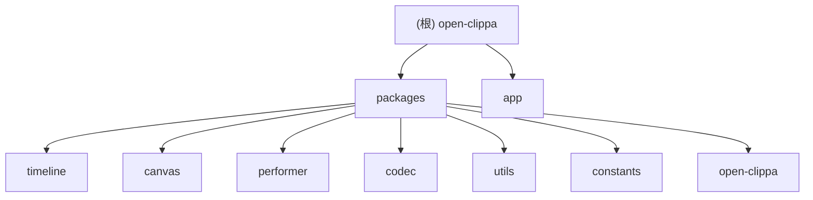

# CLAUDE.md

This file provides guidance to Claude Code (claude.ai/code) when working with code in this repository.

## 变更记录 (Changelog)

- **2025-09-24 14:58:35** - 初始化架构师自适应版扫描，生成模块文档和索引，添加 Mermaid 结构图和导航面包屑
- _之前版本内容已整合到当前版本_

## 项目愿景

Open-clippa 是一个开源的视频剪辑库构建工具，基于 TypeScript、Vue 3 和 Pixi.js 构建。项目旨在提供一个高性能、易用的时间线编辑器，支持视频片段的拖拽、缩放、播放等核心功能。

## 架构总览

项目采用 monorepo 结构，由多个核心包组成：

1. **timeline** - 核心时间线组件，提供可视化编辑界面，支持可拖拽的轨道/列车
2. **canvas** - 基于 Pixi.js 的画布渲染功能
3. **performer** - 表演者（视频元素）的抽象和实现
4. **codec** - 编解码相关功能，如帧提取
5. **utils** - 共享工具函数
6. **constants** - 常量定义
7. **open-clippa** - 主包，导出所有功能
8. **app** - Vue 3 应用程序，用于演示和测试

应用使用 Vue 3 与 Pinia 进行状态管理，Vue Router 进行路由，UnoCSS 进行样式设计。

## 模块结构图



## 模块索引

| 模块        | 路径                   | 描述                                           | 语言               | 主要依赖                                  |
| ----------- | ---------------------- | ---------------------------------------------- | ------------------ | ----------------------------------------- |
| timeline    | `packages/timeline`    | 时间线编辑器核心，包含拖拽轨道、播放头、标尺等 | TypeScript         | pixi.js, @clippa/utils, @clippa/constants |
| canvas      | `packages/canvas`      | 基于 Pixi.js 的画布渲染系统                    | TypeScript         | pixi.js, @clippa/utils, @clippa/performer |
| performer   | `packages/performer`   | 视频表演者的抽象接口和实现                     | TypeScript         | pixi.js                                   |
| codec       | `packages/codec`       | 编解码相关功能，如视频帧提取                   | TypeScript         | 无外部依赖                                |
| utils       | `packages/utils`       | 共享工具函数库，包含事件总线、时间计算等       | TypeScript         | 无外部依赖                                |
| constants   | `packages/constants`   | 常量定义，包括主题色彩等                       | TypeScript         | 无外部依赖                                |
| open-clippa | `packages/open-clippa` | 主入口包，统一导出所有功能                     | TypeScript         | 依赖所有 @clippa/\* 包                    |
| app         | `app`                  | Vue 3 演示应用程序                             | Vue 3 + TypeScript | vue, vue-router, pinia, unocss            |

## 核心架构

### 关键组件

1. **Timeline** (`packages/timeline`) - 时间线编辑核心组件
   - 使用 Pixi.js 进行渲染
   - 包含 Rails、Ruler、Cursor、Train 组件
   - 管理基于时间的可视化编辑

2. **Train** (`packages/timeline/src/train`) - 时间轴上的可拖拽元素
   - 两端有可调整大小的手柄
   - 可在不同轨道间移动
   - 管理自身状态和位置

3. **Rails** (`packages/timeline/src/rail`) - Train 的容器
   - 管理 Train 的定位
   - 处理轨道间的拖拽操作

4. **Canvas** (`packages/canvas`) - 画布渲染功能
   - 使用 Pixi.js 进行图形渲染

### 关键模式

1. **事件驱动架构** - 组件通过事件通信
2. **状态管理** - 使用单例 State 类进行全局状态管理
3. **Pixi.js 集成** - 使用 Pixi.js 实现高性能 2D 图形
4. **组件组合** - Timeline 由多个子组件组合而成

### 文件结构

```
packages/
  timeline/           # 主要时间线组件
    src/
      train/          # Train 组件（可拖拽元素）
      rail/           # Rail 组件（Train 容器）
      timeline.ts     # 主要时间线类
      ruler.ts        # 时间标尺组件
      cursor.ts       # 播放头光标
      rails.ts        # 轨道管理器
      state.ts        # 全局状态管理
  canvas/             # 画布渲染
  performer/          # 表演者实用工具
  utils/              # 共享实用工具
  codec/              # 编解码相关
  constants/          # 常量定义
  open-clippa/        # 主要导出包
app/                  # Vue 3 应用程序
  src/
    components/       # Vue 组件
    pages/            # 页面组件
    store/            # Pinia 存储
```

## 运行与开发

```bash
# 开发
pnpm dev          # 启动开发服务器
pnpm build        # 构建库
pnpm build:app    # 构建应用程序
pnpm preview      # 预览构建的应用程序

# 代码质量
pnpm lint:fix     # 运行 ESLint 并自动修复
pnpm test         # 使用 Vitest 运行测试

# 其他
pnpm cleanup      # 运行清理脚本
```

## 测试策略

- **测试框架**: Vitest
- **覆盖率**: 目前主要覆盖 utils 包的核心功能
- **测试文件**: `packages/utils/__tests__/array.test.ts`, `packages/utils/__tests__/time.test.ts`
- **测试范围**:
  - 数组交集计算
  - 时间格式转换
- **建议**: 扩大测试覆盖范围，特别是 timeline 和 canvas 包的核心功能

## 编码规范

- **语言**: TypeScript (ESNext)
- **风格**: ESLint + @antfu/eslint-config
- **提交**: Conventional Commits + commitlint
- **构建**: Rolldown (库) + Vite (应用)
- **包管理**: pnpm (workspace)

## AI 使用指引

1. **架构理解**: 项目采用事件驱动架构，组件间通过 EventBus 通信
2. **核心概念**: Train (可拖拽视频片段)、Rail (轨道容器)、Timeline (时间线)、Performer (表演者)
3. **状态管理**: 使用单例 State 类管理全局状态
4. **渲染**: 所有图形渲染基于 Pixi.js 提供高性能 2D 图形
5. **组件组合**: Timeline 由多个子组件组合而成

## 开发工作流

1. 在 `packages/` 中修改相应的包
2. 在 `app/` 中的 Vue 应用中测试更改
3. 运行 `pnpm build` 构建包
4. 运行 `pnpm dev` 启动开发服务器
5. 使用 `pnpm lint:fix` 确保代码质量

### 测试

使用 Vitest 运行测试：

```bash
pnpm test           # 运行所有测试
pnpm test --watch   # 在监视模式下运行测试
```

### 构建过程

项目使用 Rolldown 构建包，使用 Vite 构建应用程序。构建配置位于 `rolldown.config.ts`。
